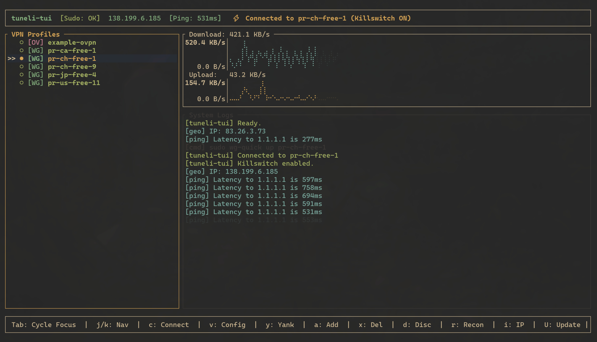

# tuneli-tui ⚡

A lightning-fast, terminal-based VPN manager (TUI) for Linux and macOS. Manage your WireGuard and OpenVPN connections with a focus on speed, safety, and visual telemetry.



## Features

- **Multi-Protocol Support**: Full support for **WireGuard** (`wg-quick`) and **OpenVPN**.
- **Cross-Platform**: Tailored for **Linux** (nftables) and **macOS** (pfctl).
- **Kill Switch Protection**: Prevents IP leaks by locking down the firewall when the VPN drops.
- **Visual Telemetry**:
  - Live network throughput charts (sparklines).
  - Public IP tracking with GeoIP awareness.
  - Active connection status badges.
- **Config Management**:
  - Automatically discovers profiles from system paths.
  - Built-in Configuration Viewer with clipboard support (Linux/macOS).
  - Add new configurations directly from the TUI.
- **Auto-Updates**:
  - Pulls updates directly from GitHub Releases (`U`).
- **Safe & Secure**:
  - Sudo password caching (piped directly to `stdin`, never stored in plain text on disk).
  - Automatic disconnection on exit.

## Configuration Paths

The app automatically scans the following directories for profiles:

### Linux
- **WireGuard**: `/etc/wireguard/*.conf`
- **OpenVPN**: `/etc/openvpn/*.{conf,ovpn}`

### macOS (Homebrew)
- **WireGuard**: `/opt/homebrew/etc/wireguard/*.conf`
- **OpenVPN**: `/opt/homebrew/etc/openvpn/*.{conf,ovpn}`

## Keybindings

| Key | Action |
|-----|--------|
| `Enter` / `c` | Connect to selected profile |
| `d` | Disconnect active profile |
| `r` | Reconnect selected profile |
| `Tab` | Switch focus between Profiles and Logs |
| `v` | View configuration content |
| `y` | Yank (Copy) config to clipboard (when viewing) |
| `a` | Add new VPN configuration |
| `i` | Refresh Public IP manually |
| `s` | Set/Change Sudo password |
| `U` | Auto-update to latest GitHub Release |
| `?` | Toggle Help Menu |
| `q` / `Esc` | Quit / Close Modal |
| `Ctrl+C` | Force Exit (with cleanup) |

## Requirements

### Linux
- `wireguard-tools` (`wg-quick`)
- `openvpn`
- `nftables` (for Kill Switch)
- `wl-clipboard`, `xclip`, or `xsel` (optional for better clipboard support)

### macOS
- `wireguard-tools` (`brew install wireguard-tools`)
- `openvpn` (`brew install openvpn`)
- `pf` (built-in, used for Kill Switch)

## Installation

```bash
# Clone the repository
git clone https://github.com/youruser/tuneli-tui.git
cd tuneli-tui

# Build and run
cargo run --release
```

## Security Note

`tuneli-tui` requires `sudo` permissions to manage network interfaces and firewall rules. It handles your password securely by piping it directly to system commands via `stdin` and scrubbing it from all log outputs.

## Generating a Release

To create and publish a new version of `tuneli-tui`:

1. Update the `version` field in `Cargo.toml`.
2. Commit your changes.
3. Create a new tag matching the `v*` format (e.g., `v1.0.0`).
4. Push the tag to GitHub.

```bash
git add Cargo.toml
git commit -m "chore: bump version to v1.0.0"
git tag v1.0.0
git push origin v1.0.0
```

The embedded **GitHub Actions Workflow** will automatically intercept the tag, compile the optimized binaries for Linux (`x86_64`) and macOS (`aarch64`), compress them into `.tar.gz` payloads, and publish them directly to the GitHub Releases page. This allows the built-in auto-updater and `install.sh` scripts to instantly distribute the new version.
